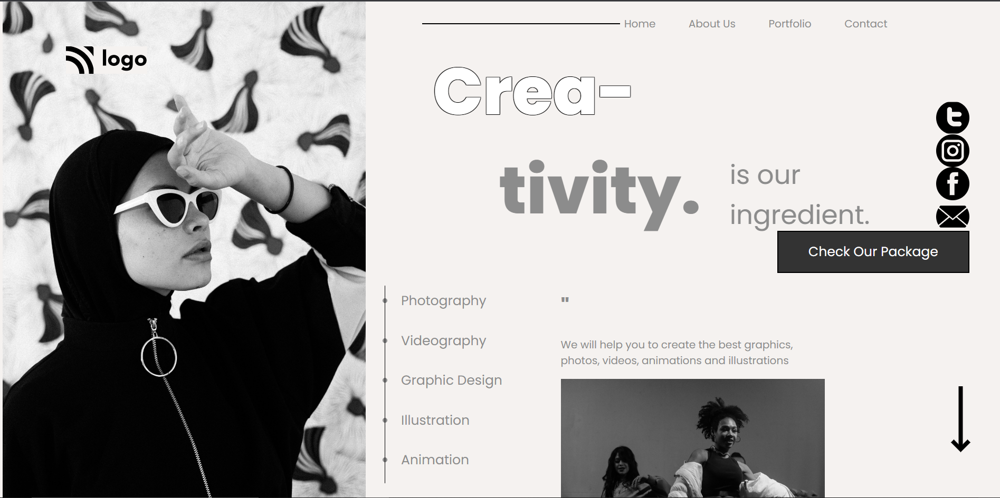
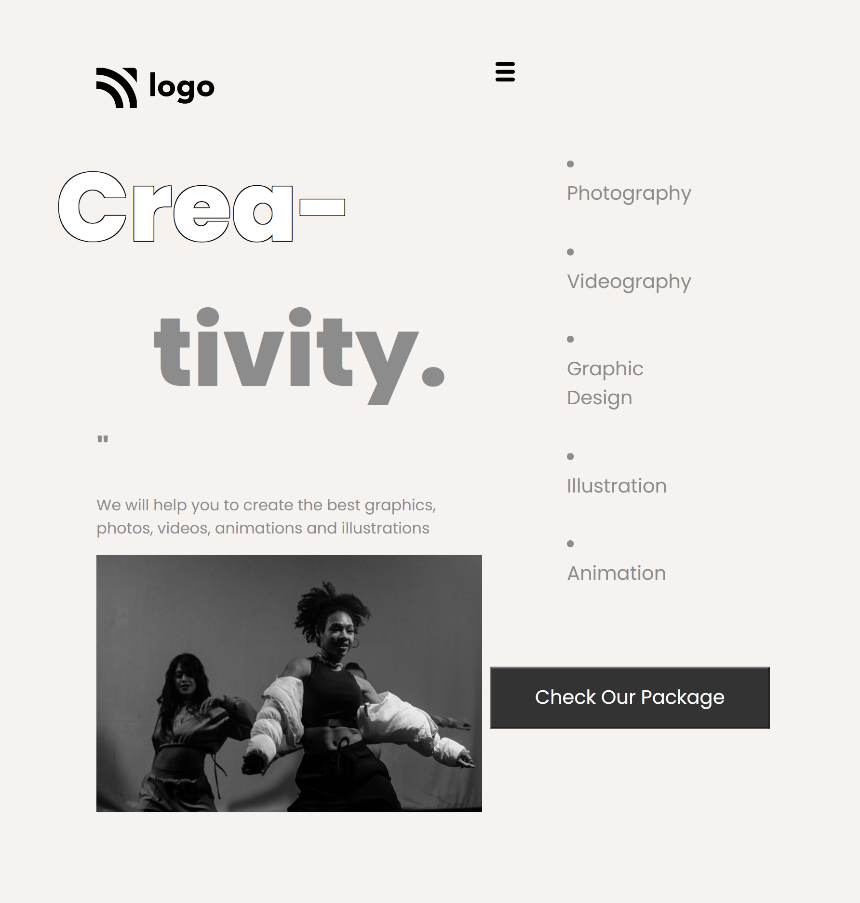

# Hi 👋 I am Devang 
 

## Project Name : **Dance Academy Landing Page !**

The output looks is great for this project a hero photo covering the right side using Z-index and all the content is on the left. The CSS code can be written so much better for the one that I have written. One thing that I have note after this is using of position will create havoc while using media query.

 

​

# 💻 Tech Stack Used :

​
  

 
​

## 📝 Features

- Responsive for screen size below 600px

- Hosted on Netlify

 

😌 Honest Time to finish the project

     It took me about 5 hrs

 

### You can Check it Live on Below Link :

[Live Link !]()

 

##  Final Output

 

##  Final Output for screen width below 600px

​

